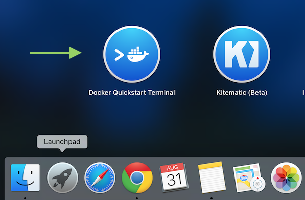

# 开发环境搭建

## 安装toolbox
下载地址：
> https://www.docker.com/products/docker-toolbox  
> https://get.daocloud.io/toolbox/


## Docker Toolbox
Toolbox是一个安装器，目前支持Mac和Windows平台。使用它可以快速地在安装Docker工具集。  
Toolbox可以安装你在开发中运行Docker时所需要的一切：Docker客户端、Compose、Kitematic、Machine以及VirtualBox。Toolbox使用Machine和VirtualBox在虚拟机中创建了一个引擎来运行容器。
  

安装完后点击`Docker Quickstart Terminal`可以启动docker  
**注意：** windows平台如果已经安装了git、virtualbox建议先卸载掉，使用Docker Toolbox自带的git和virtualbox。


## 手动启动
也可以通过执行命令的方式启动docker  
查看已有的machine
```
$ docker-machine ls
NAME      ACTIVE   DRIVER       STATE     URL                         SWARM   DOCKER    ERRORS
default   *        virtualbox   Running   tcp://192.168.99.100:2376           v1.11.2
```

如果没有machine可以通过命令来创建
```
$ docker-machine create --driver <类型> <主机名称>
$ docker-machine create --driver virtualbox default
```

启动docker machine
```
$ docker-machine start <主机名称>

$ docker-machine env <主机名称>

eval $(docker-machine env <主机名称>)
```


## Mac os 安装
安装docker toolbox  
参考：  
> https://docs.docker.com/mac/step_one/

## Windows 安装
安装docker toolbox安装  
参考：  
> https://docs.docker.com/windows/step_one/

下载地址：  
> https://www.docker.com/products/docker-toolbox

DaoCloud加速版
> https://get.daocloud.io/toolbox/windows
> https://get.daocloud.io/toolbox/mac


## 共享文件
一旦`docker-machine`启动之后，会自动共享本机的`/Users`到虚拟机，如果你需要共享的内容不在`/Users`需要在VirtualBox添加共享文件夹

### VirtualBox添加
打开VirtualBox选中虚拟机点击`设置`，进入设置选中`共享文件夹`


**共享文件夹路径**：本地需要共享到虚拟机的路径  
**共享文件夹名称**：虚拟机中的共享名称  


### 挂载共享的目录
手动挂载
```bash
sudo mkdir <挂载的目录>
sudo mount -t vboxsf <共享名> <挂载的目录>
```

在`/var/lib/boot2docker`目录创建文件`bootlocal.sh`，每次启动后都会自动挂载共享的目录
```bash
vi /var/lib/boot2docker/bootlocal.sh

# 添加以下内容
mkdir <挂载的目录>
sudo mount -t vboxsf -o uid=1000,gid=1000 <共享名> <挂载的目录>
```