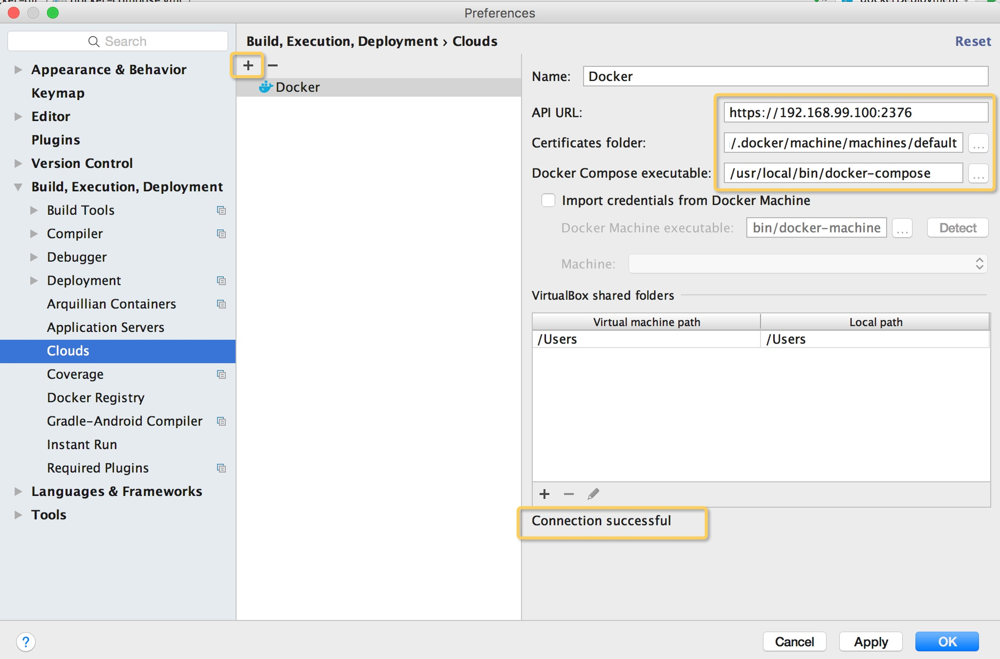

# Java开发环境搭建

## 搭建步骤
1.启动`Docker Quickstart Terminal`


2.导入镜像  
```
# 导入本地镜像文件
docker load -i registry.somedomain.com-dev-tomcat.8.0.tar
docker load -i registry.somedomain.com-dev-mysql.5.6.tar
docker load -i registry.somedomain.com-dev-redis.3.2.tar
# 通过命令获取镜像
docker pull registry.somedomain.com/dev/tomcat:8.0
```

3.安装Intellij Idea 2016版，低版本对Docker支持不够好

4.在Intellij IDEA Settings中选择Plugins选项，选择`Docker Integration`安装。


5.配置远程docker主机
　在Settings里的Clouds选择添加Clouds配置点击+选择`Docker`  
`Name`: Docker (任意填写)  
`API URL`：配置Docker主机的（远程IP+端口）  
`Certificates folder`： 可以为空  
`docker-compose`： docker-compose的可执行文件位置。   
配置正确后，出现`Connection successful`配置成功。


6.在项目的根目录新建一个文件夹`docker-dir`，再新建一个文件`docker-compose.yml`，内容如下：

```bash
tomcat:
  image: registry.somedomain.com/dev/tomcat:8.0   # root用户的密码
  container_name: java_tomcat                   # 容器名称
  ports:                                        # tomcat的端口号
    - "18080:8080"
  volumes:
    - ./docker1.war:/usr/local/tomcat/ROOT.war  # war文件
  command:
    ["/usr/local/tomcat/deployWar.sh"]          # 解压war启动taomcat

db:
  image: registry.somedomain.com/dev/mysql:5.6    # 镜像名称
  container_name: java_mysql                    # 容器名称
  ports:
    - "3306:3306"                               # mysql的端口号
  environment:
    MYSQL_ROOT_PASSWORD: 123456                 # root用户的密码
```

7.进入`Project Structure`，选择`Artifacts`
点击`+` 选择`Web Application: '<project-name>:war exploded'`.
`Name`: Docker Artifacts  
`Type`: Web Application: Archive  
`Output Directroy`:设置成刚才新建的`docker-dir`  


8.打开`Run Configurations`，添加`Docker Deployment`  
`Name` 名称  
`Server` 选择Clouds项添加的Docker  
`Deployment` 选择`docker-dir/docker-compose.yml`
`Before Launch`: 选择`Build Artifacts`里的`Docker Artifacts`


