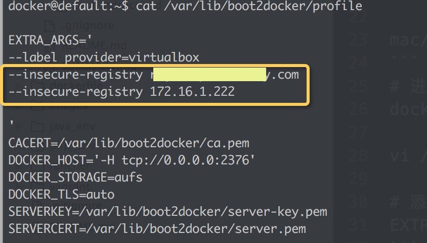

# 私有仓库


## 操作

当执行`docker login`时会出现以下错误：
```
Error response from daemon: Get https://registry.somedomain.com/v1/users/: dial tcp 101.200.152.229:443: getsockopt: connection refused
```
* 注：Registry默认是https,使用http需要修改配置文件，否则会报错：

linux环境

```dev
vi /etc/default/docker
# 添加如下内容
DOCKER_OPTS="--insecure-registry registry.somedomain.com"  

# 修改完重启docker服务
sudo service docker restart
```

mac/windows下docker machine
```
# 进入虚拟机
docker-machine ssh <machine name>

vi /var/lib/boot2docker/profile

# 添加如下内容
EXTRA_ARGS="--insecure-registry registry.somedomain.com"

# 退出虚拟机并重启
exit
docker-machine restart <machine name>
```
**注：** 如果已经存在了`EXTRA_ARGS`,添加`--insecure-registry registry.somedomain.com`到`EXTRA_ARGS`里


## 登录

```bash
docker login -u=<用户名> -p=<密码> -e=<邮箱> registry.somedomain.com
Login Succeeded 

# 下载镜像，标签可省略
docker pull regitstry.somedomain.com/<镜像名>:<标签>
docker pull regitstry.somedomain.com/php:7.0

# 镜像改名
docker tag php regitstry.somedomain.com/php:7.0


# 查找镜像

```

## 安装私有库
```bash
# 下载镜像
docker pull registry
docker pull registry:2.4.1

# 运行registry
docker run -d -v /opt/registry:/var/lib/registry -p 127.0.0.1:5000:5000 --restart=always --name registry registry:2.4.1
```

利用docker-compose启动容器

```
docker-composer up -d
```
以下是`docker-compose.yml`
```
registry:
  image: registry:2.4.1
  ports:
    - 127.0.0.1:5000:5000
  environment:
    REGISTRY_STORAGE_FILESYSTEM_ROOTDIRECTORY: /data
  volumes:
    - /opt/registry:/data
```

## 添加HTTP验证
通过Nginx的Basic HTTP authentication来添加HTTP验证
生成用户名密码
```bash
htpasswd -bc <密码文件位置> <用户名> <密码>
htpasswd -bc /opt/docker/registry/registry.password someuser password
```
参考： https://docs.docker.com/registry/recipes/nginx/


