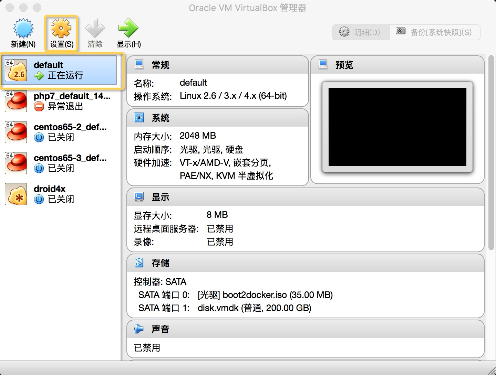
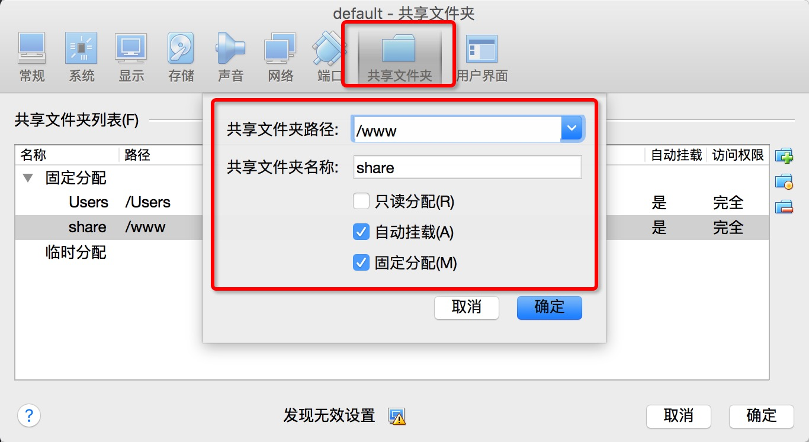

# 共享文件


一旦`docker-machine`启动之后，会自动共享本机的`/Users`到虚拟机，如果你需要共享的内容不在`/Users`需要在VirtualBox添加共享文件夹  
如果你的项目文件没有在当前用户目录下，可以通过建立软链的方式把项目链接到用户目录
```
ln -s <source> <target>

# mac
ln -s /www ~/www
# 虚拟机里的位置
/Users/当前用户名/www

# windows 通过git bash或者Cygwin等工具
ln -s /d/wamp /c/Users/当前用户名/wamp
# 虚拟机里的位置
/c/Users/当前用户名/wamp
```

### VirtualBox添加
打开VirtualBox选中虚拟机点击`设置`，进入设置选中`共享文件夹`



**共享文件夹路径**：本地需要共享到虚拟机的路径  
**共享文件夹名称**：虚拟机中的共享名称  


### 挂载共享的目录
手动挂载
```bash
sudo mkdir <挂载的目录>
sudo mount -t vboxsf <共享名> <挂载的目录>
```

在`/var/lib/boot2docker`目录创建文件`bootlocal.sh`，每次启动后都会自动挂载共享的目录
```bash
vi /var/lib/boot2docker/bootlocal.sh

# 添加以下内容
mkdir <挂载的目录>
sudo mount -t vboxsf -o uid=1000,gid=1000 <共享名> <挂载的目录>
```
